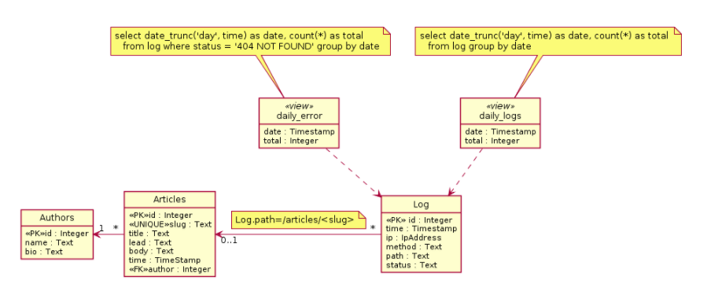

## SQL Logs Analysis Project
This respository is for project #3 (Logs Analysis) 
for the [Udacity Fullstack Developers Nano Degree](https://www.udacity.com/course/full-stack-web-developer-nanodegree--nd004).
### Table of Contents

* [Installation](#installation)
    * [Setup AWS Cloud 9 - If used instead of Vagrant](#setup-aws-c9)
    * [Project Setup](#project-setup)
* [Database Overview](#database-overview)
* [Running](#running)

### Installation

#### Setup AWS C9
Environment Setup (Postgres on Amazon Clound 9 Instance):

See reference: https://gist.github.com/dstroot/2920991

```
# Install Postgres
sudo yum -y install postgresql postgresql-server postgresql-devel postgresql-contrib postgresql-docs
sudo service postgresql initdb

# Setup initial 'postgres' user password

sudo -u postgres psql postgres
postgres=# \password postgres

#You'll see:
#Enter new password:
#Enter it again:

# Use MD5 Authentication
sudo sed -i.bak -e 's/ident$/md5/' -e 's/peer$/md5/' /var/lib/pgsql9/data/pg_hba.conf

#Start
sudo /sbin/chkconfig --levels 235 postgresql on
sudo service postgresql start

#Login as 'postgres' user using password setup above
psql -U postgres

```
Install Python Libraries

```
sudo yum install flask
sudo pip install psycopg2
sudo pip install Bleach

```

Create database
```
psql -U postgres
postgres=# create database news;
postgres=# grant all privileges on database news to postgres;
postgres=# \list
```
Connect to Database and List Tables
```
postgres=# \connect news
news=# \dt

```

Load the Database
```
psql -U postgres -d news -f newsdata.sql
```
#### Project Setup
Create Database Views
```
create view daily_errors as select date_trunc('day', time) as date, count(*) as total from log where status = '404 NOT FOUND' group by date;
create view daily_logs as select date_trunc('day', time) as date, count(*) as total from log group by date;                    
```

Clone the respository:

```
git clone https://github.com/tsherburne/udacity-fsdev-logs.git
cd udacity-fsdev-logs
```

If needed, change the database connection string in `report.py`

```
db = psycopg2.connect(database="news", user="postgres", password="postgres1234")
```
#### Database Overview
The schema for the reports database is shown here:


### Running
Run the Report:
```
python report.py
```